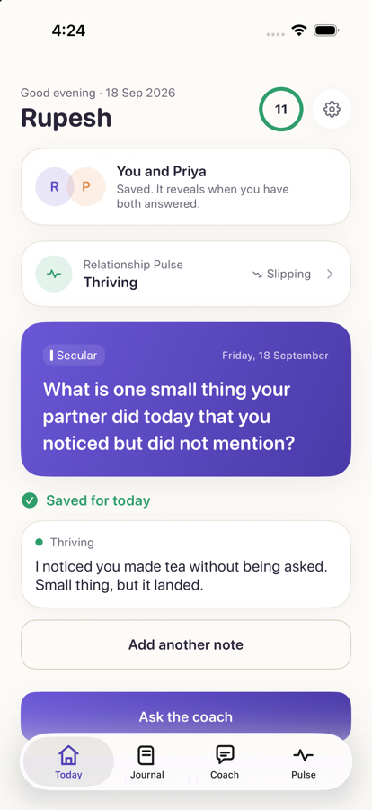
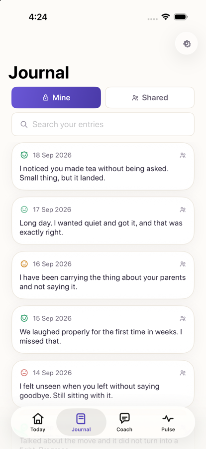
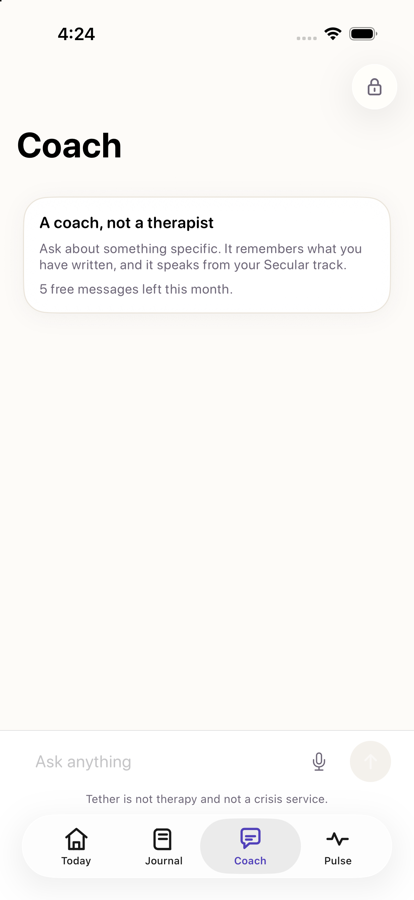
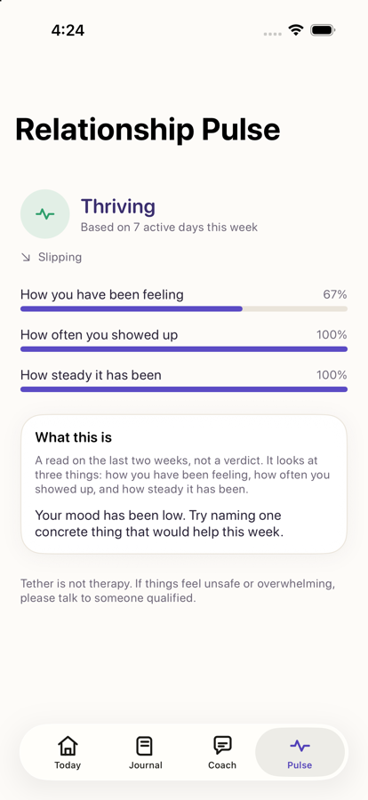
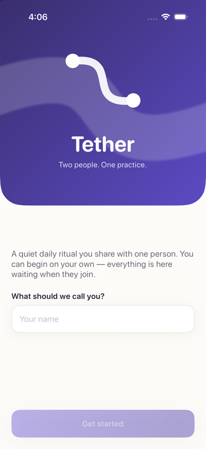

# Tether

**Two people. One practice.**

A private iOS app for couples who don't share a single worldview. Each partner
answers one short question a day — and each chooses their own wisdom track, so a
Hindu and a Christian partner are each spoken to in their own framework while
sharing the same daily ritual.

`SwiftUI` · `SwiftData` · `CryptoKit` · `iOS 17+` · local-first · end-to-end encrypted

---

## Why this exists

Every serious couples app on the market assumes a shared worldview. Paired,
Lasting, Couply, Evergreen, Relish and Twogle are all either secular-generic or
implicitly Christian. None of them let a Hindu–Muslim, Christian–atheist, or
interfaith couple see themselves in the product.

In the United States, roughly **four in ten marriages cross religious lines** and
about **thirty percent of adults are religiously unaffiliated**. That is a large,
growing, and currently unserved market.

Tether's answer is architectural, not cosmetic: **wisdom track is a property of
the person, not the couple.** The practice is shared; the beliefs are not.

---

## Screenshots

| Today | Journal |
|---|---|
|  |  |

| Coach | Relationship Pulse |
|---|---|
|  |  |



Every icon is a custom SVG from the app's own icon set — no SF Symbols, no icon
library. The curve mark is used as the app icon, the welcome hero, a screen
backdrop, and the pairing animation.

---

## Technical highlights

The parts worth reading.

### 1. Local-first, not offline-tolerant

Every read is served from SwiftData on device. The network is used only to sync,
and **no network layer exists yet — the app is fully functional without one.**
This was a deliberate architectural choice rather than a feature: it eliminates
an entire class of sync bugs, and it means the product works on a plane, in a
subway, or with a dead backend.

### 2. The data model encodes the product thesis

Track selection is keyed on `user_id`, not `couple_id`:

```sql
CREATE TABLE user_tracks (
  user_id  UUID NOT NULL REFERENCES profiles(id),
  track_id wisdom_track NOT NULL,
  PRIMARY KEY (user_id, track_id)
);
```

The differentiator is enforced by the schema, not by UI convention. A future
developer cannot accidentally couple the two partners' tracks without a
migration that would be obvious in review.

### 3. End-to-end encryption with a stated cost

Journal entries, coach conversations, and AI memory are sealed with **AES-256-GCM**
using a key held in the Keychain with `kSecAttrAccessibleAfterFirstUnlockThisDeviceOnly`
— never synced to iCloud, never restored to a new device.

The trade-off is surfaced in Settings rather than buried:

> *"There is no recovery if you lose every device. That is the cost of us not
> being able to read your words."*

Storage format is `enc:v1:<base64>` with a version prefix for future rotation,
and plaintext passthrough so existing rows need no migration.

**Verified, not assumed** — a standalone round-trip test confirms: round-trip
exactness, empty-string safety, idempotent sealing, legacy plaintext passthrough,
and **tamper rejection** (a single flipped bit in the ciphertext is rejected by
GCM authentication rather than silently decrypted).

### 4. Safety is pipeline stage one, not a filter

The AI pipeline orders operations deliberately:

```
user input
   ↓
[1] SAFETY CLASSIFIER ──crisis──► resource card, no reply, nothing persisted
   ↓ safe
[2] MEMORY RETRIEVAL ──► top-3 relevant past entries
   ↓
[3] GENERATION ──► grounded in the asking partner's own track
```

Four invariants are enforced in code, not by convention:

1. A crisis produces **no assistant reply** — helplines replace it.
2. Crisis content is **never written to memory**, so it cannot resurface weeks later.
3. The partner is **never** shown the other's crisis signal.
4. Coach-derived memories default to `visibility: .private`.

> **Known gap, flagged in code:** the classifier is currently phrase-based and is
> marked in-file as a placeholder. A server-side model classifier is required
> before launch.

### 5. Swappable seams where they matter

Two protocols exist so the expensive parts can be replaced without touching
callers:

- `MemoryRetrieving` — currently keyword-overlap scoring with a recency tiebreak.
  Swaps to pgvector cosine search on the backend with no call-site changes.
- `CoachProviding` — currently an on-device provider. Shaped exactly like the
  Claude call will be, so `ClaudeCoachProvider` is a drop-in.

The same applies to `PurchaseService`: purchases are simulated locally, and
RevenueCat replaces one class when credentials exist.

### 6. Content architecture designed to scale

```
Universal psychological core   (Gottman · EFT · attachment · NVC)
        ↓
Wisdom track expression        (Secular · Vedic · Quranic · Biblical)
        ↓
Cultural context               (US individualist · immigrant · joint-family · global)
        ↓
Language                       (en → es → hi → ta → te → ur)
```

One core, many expressions — how the content scales to eight languages without
eight times the writing. **360 prompts ship today: 90 per track across all four.**

---

## Architecture

```
┌──────────────────────────────────────────────────────┐
│  CLIENT · SwiftUI · iOS 17+ · iPhone                 │
│                                                      │
│   UI          →  screens + design system             │
│   State       →  @Observable                         │
│   Local store →  SwiftData (source of truth)         │
│   Crypto      →  AES-256-GCM, keys in Keychain       │
└───────────────────────┬──────────────────────────────┘
                        │  (no network layer yet — by design)
┌───────────────────────▼──────────────────────────────┐
│  PLANNED · Supabase                                  │
│   Postgres + RLS · Auth · Realtime · Edge Functions  │
│   pgvector for couple memory                         │
└──────────────────────────────────────────────────────┘
```

---

## Features

| | |
|---|---|
| **Onboarding** | Name → wisdom track → Love Languages → first prompt. Under two minutes. |
| **Daily loop** | One prompt, a five-point mood tap, one sentence. Replies stay **hidden until both answer**. |
| **Solo mode** | Full value with no partner. Nothing is gated behind their participation. |
| **Pairing** | Link + QR + 6-digit code, a real waiting room, capped nudges, and a 72-hour solo fallback. |
| **Relationship Pulse** | A 14-day read from mood, cadence, and consistency. **Describes; never predicts.** |
| **Weekly recap** | Streak, entries, average mood, one memory, one focus. |
| **AI coach** | Couple memory, per-track grounding, seven intents, "Remembering" indicator. |
| **Safety** | Crisis detection, confidential resources, partner never notified. |
| **Paywall** | Free tier, trial, three products. **One subscription covers both partners.** |
| **Notifications** | Per-partner send times; permission requested after first value, never at launch. |

---

## Design system

Warm paper rather than clinical white. Full specification in
[`docs/APP-DESCRIPTION-PROMPT.md`](docs/APP-DESCRIPTION-PROMPT.md).

| Role | Value |
|---|---|
| Background | `#FDFBF8` warm cream |
| Brand gradient | `#6A57D6` → `#4A3AA8` |
| Warm accent | `#E08A4B` terracotta |
| Text | `#2A2438` warm near-black |
| Type | SF Pro Rounded throughout |

**The motif.** A single curve joining two points with slack between them — two
people, connected, still free to move. It appears as the app icon, the welcome
hero, a faint screen backdrop, and the pairing animation. One shape used
consistently is what makes an app read as *designed* rather than assembled.

Track identity colours: Secular `#4A7DBF` · Biblical `#7B6BD6` ·
Vedic `#D98A2B` · Quranic `#2E9E7B`

---

## Project structure

```
TetherApp/
├── Tether.xcodeproj          generated — see below
├── make_xcodeproj.py         builds the Xcode project from Swift sources
├── Tether/
│   ├── TetherApp.swift       app entry + RootView
│   ├── Theme.swift           colour, type, spacing, depth, buttons
│   ├── TetherArt.swift       the curve motif, backdrop, avatars
│   ├── Models.swift          domain enums + SwiftData models
│   ├── Store.swift           session state, streaks, pairing service
│   ├── Components.swift      reusable UI
│   ├── Content*.swift        360 prompts across four tracks
│   ├── CryptoService.swift   AES-256-GCM + Keychain
│   ├── Safety.swift          classifier + crisis resources
│   ├── CoachEngine.swift     retrieval + provider protocols
│   ├── *Views.swift          onboarding, home, pairing, pulse, coach, paywall
│   └── Assets.xcassets/      app icon + accent colour
├── Branding/
│   ├── icon.html             icon source (SVG)
│   └── wallpapers/           three 1290×2796 wallpapers
└── docs/
    ├── 01-PRD.pdf            product requirements
    ├── 02-TRD.pdf            technical requirements
    ├── 03-UIUX-DESIGN.pdf    UI/UX specification
    ├── 04-BACKEND-SCHEMA.pdf full DDL + RLS policies
    └── BIBLICAL-TRACK-REVIEW-BRIEF.md
```

### On the generated Xcode project

`make_xcodeproj.py` generates a valid `.xcodeproj` from a folder of Swift sources,
so the project can be created and **built headlessly without opening Xcode**:

```bash
python3 make_xcodeproj.py && plutil -lint Tether.xcodeproj/project.pbxproj
xcodebuild -project Tether.xcodeproj -scheme Tether \
  -sdk iphonesimulator -destination 'generic/platform=iOS Simulator' build
```

Re-run it after adding or removing any Swift file.

---

## Getting started

```bash
git clone <repo-url> && cd TetherApp
python3 make_xcodeproj.py
open Tether.xcodeproj
```

Then select your Team under **Signing & Capabilities** and run on a simulator or
device. The app needs no backend, no API keys, and no network connection.

---

## Current status

**Working end-to-end today:** onboarding, daily loop, solo mode, the full six-screen
pairing flow, journal, Relationship Pulse, weekly recap, AI coach with memory,
safety pipeline, encryption at rest, paywall, notifications. 360 prompts across
four tracks. Fully offline.

**Deliberately stubbed, and labelled as such in code:**

| Item | Why |
|---|---|
| RevenueCat | Needs store credentials. `PurchaseService` is the only class that changes. |
| Supabase backend | Sync and real two-device pairing. The app works without it. |
| Voice input | The button is wired but inert. |
| Safety classifier | Phrase-based placeholder. **Must be replaced before launch.** |
| Vedic / Quranic / Biblical content | Written, but **requires review by practitioners of each tradition** before release. |

**Android is deferred.** That is a conscious trade-off against roughly half the
US market, recorded rather than quietly dropped.

---

## Documentation

Four documents written before a line of code, in [`docs/`](docs/):

- **PRD** — personas, 65 numbered requirements with acceptance criteria, KPIs, risks
- **TRD** — architecture, stack rationale, sync strategy, AI pipeline, compliance
- **UI/UX spec** — design system, component library, 18-screen inventory, motion, a11y
- **Backend schema** — full DDL, indexes, complete RLS policies, API map

---

## Security

Found a vulnerability? Please email **rupeshjat5@gmail.com** rather than opening a
public issue.

Tether handles intimate personal content. Security and privacy are treated as
product features, not compliance overhead. No third-party SDK has access to user
content, and no content is ever sent to analytics.

---

## Licence

**Proprietary. All rights reserved.** See [LICENSE](LICENSE). Viewing this
repository grants no licence.

---

<p align="center"><sub>Built by <a href="mailto:rupeshjat5@gmail.com">Rupesh Kadyan</a></sub></p>
